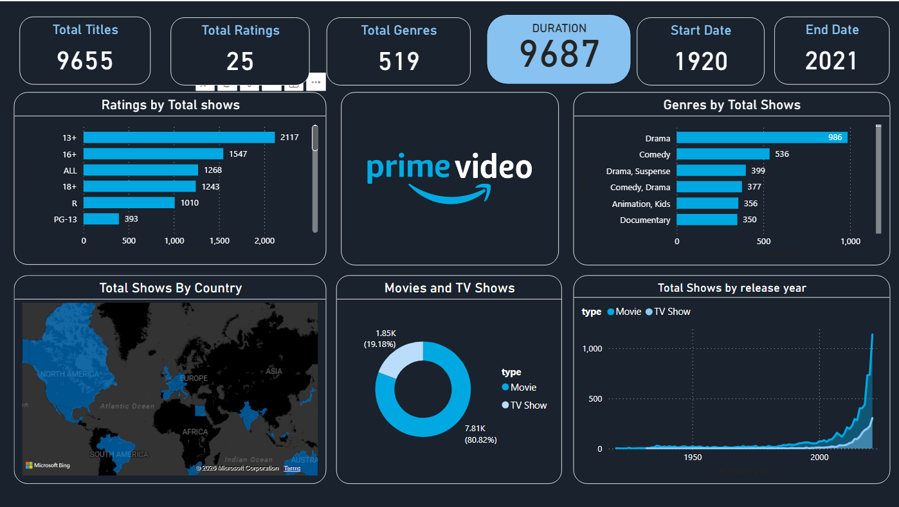

The Prime Video Dashboard is an interactive Power BI project developed to analyze and visualize Prime Video's content library. The dashboard provides insights into titles, genres, ratings, release trends, content types, and geographical distribution of shows and movies available on the platform.

## Project Objectives

* Analyze Prime Video content data using interactive visualizations.
* Identify trends in content releases over time.
* Explore genre popularity and rating distribution.
* Compare Movies and TV Shows.
* Visualize content availability across different countries.

##  Tools & Technologies

* Power BI
* DAX (Data Analysis Expressions)
* Power Query
* Excel/CSV Dataset

## Dashboard Highlights

### Key Performance Indicators (KPIs)

* Total Titles: 9,655
* Total Ratings: 25
* Total Genres: 519
* Content Duration: 7,687
* Content Timeline: 1920 – 2021

### Visualizations Included

* Ratings Distribution by Total Shows
* Genre-wise Content Analysis
* Country-wise Content Distribution (Map Visualization)
* Movies vs TV Shows Comparison
* Release Year Trend Analysis
* Interactive Filters and Drill-down Features

##  Key Insights

* Drama is the most dominant genre on Prime Video.
* Movies account for approximately 81% of the content library.
* Significant growth in content releases is observed after 2010.
* Content is distributed across multiple countries, highlighting Prime Video's global reach.
* The majority of content falls under the 13+ and 16+ rating categories.

## 📸 Dashboard Preview

##  Live Dashboard

View the interactive dashboard here:

https://app.powerbi.com/view?r=eyJrIjoiYWVjMzJiZTYtODIzNy00ZDcyLWE3ZDctMGI3MWRhZjZjY2RhIiwidCI6IjgwOGNjODNlLWE1NDYtNDdlNy1hMDNmLTczYTFlYmJhMjRmMyIsImMiOjEwfQ%3D%3D

##  Repository Contents

* PRIME VIDEO DASHBOARD.pbix
* Dashboard Screenshot
* README.md

##  Author

**Nitesh Kumar Bevara**

LinkedIn: https://www.linkedin.com/in/nitesh-kumar-18a7a1245/
